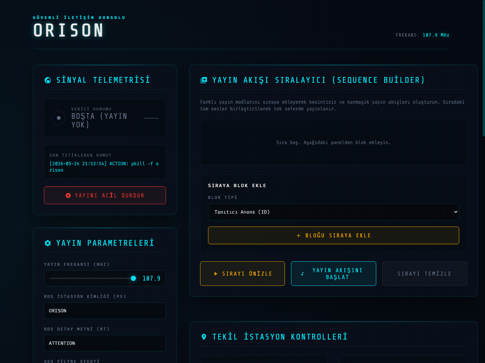

# ORISON // Tactical Radio Terminal & FM RDS Station



ORISON is a modern, PWA-supported web control terminal that gives users the opportunity to set up their own personal numbers station over FM, enabling a Raspberry Pi to broadcast FM signals and transmit dynamic RDS (Radio Data System) data directly via its GPIO pins using hardware DMA (Direct Memory Access).

Based on the **PiFmRds** core, this project adds advanced text-to-speech voice generation, a Morse code generator, digital bandpass audio filter effects, and background interference/noise simulations.

> [!WARNING]
> **LEGAL NOTICE:** Broadcasting on FM frequencies may be illegal in your country or region without an official license or authorization. This software is designed for educational, laboratory, and simulation purposes only. The user assumes all legal responsibility for any interference caused or regulatory compliance issues arising from the usage of this software.

---

## 📡 Core Features

- **Dynamic Frequency Tuning (MHz):** Real-time frequency updates in the range of `87.5 - 108.0 MHz` using the slider on the interface.
- **Dynamic RDS Control:** Real-time updates to the station name (PS - Program Service, max 8 chars) and detail text (RT - Radio Text, max 64 chars) during active broadcast.
- **Broadcast Preview Mode:** Listen to any generated sequence or audio directly inside the browser before transmitting it over-the-air on FM.
- **Tactical Audio Filters:**
  - *AM Radio Mode:* Standard military radio band simulation (bandpass filter).
  - *Bunker Echo:* Underground bunker simulation using reverb effects.
  - *Tape Drift:* Vintage tape deck simulation using tremolo effects.
  - *Raw Clean Audio:* Unfiltered clean audio output.
- **Shortwave Interference (Noise):** Tactical background noise mixing white noise and 50Hz power grid hum.
- **Morse Code Transmitter:** Dynamically converts text to Morse code and broadcasts it using custom beep frequencies and speed options.
- **Broadcast Queue Sequencer:** Chain station IDs, Morse code sequences, and synthetic voice text blocks to build seamless and automated playlists.
- **PWA (Progressive Web App) Support:** Can be installed on Android/iOS via Chrome or Safari as a standalone full-screen tactical application (including custom launcher icon).

---

## 📁 Project Structure

```text
orison/
├── scripts/
│   ├── orison                  # Main Python CLI management script
│   └── orison-broadcast        # Bash script handling PiFmRds and DMA management
├── sudoers/
│   └── orison                  # Sudoers configuration for passwordless systemctl/ln commands
├── systemd/
│   └── orison-web.service      # Systemd service automatically starting the Flask web app
├── web/
│   ├── app.py                  # Flask backend service and REST API endpoints
│   ├── static/                 # Manifest, Service Worker, and PWA icon assets
│   └── templates/
│       └── index.html          # HTML5/JS frontend dashboard with a retro CRT console design
└── .gitignore                  # Gitignore file filtering temporary audio and log files
```

---

## ⚙️ Installation and Deployment (on Raspberry Pi)

### Method A: Automatic Installation (Recommended)

You can automatically install the project using a single command. The installation script (`install.sh`) installs system dependencies, compiles the `PiFmRds` module, automatically detects the username on the new Pi, and dynamically updates all paths (e.g. replacing `/home/host` with `/home/pi` as needed) in the configuration templates.

1. Clone the repository onto the Pi:
   ```bash
   git clone https://github.com/cagriakyurt/orison-station.git ~/station
   ```
2. Navigate to the project directory and run the installation script:
   ```bash
   cd ~/station
   chmod +x install.sh
   ./install.sh
   ```

---

### Method B: Manual Installation (Reference)

If you prefer to run the setup steps manually instead of using the automated script:

> [!IMPORTANT]
> **Username Note:** Default paths in project files are configured for the user `host`. If your username on the Raspberry Pi is different (e.g. the standard `pi`), you must run the username update command in **Step 4** before configuring the services.

#### Step 1: Install Basic Dependencies
Open a terminal on your Pi and install voice synthesis, audio processing, and web server tools:
```bash
sudo apt-get update
sudo apt-get install git sox libsox-fmt-all espeak-ng python3-pip python3-flask -y
```

#### Step 2: Compile the PiFmRds Core
Clone and build the core library that generates the FM radio carrier waves:
```bash
# Clone repository to home directory
cd ~
git clone https://github.com/ChristopheJacquet/PiFmRds.git

# Start the compilation
cd PiFmRds/src
make
```
*This will generate an executable binary file at `/home/YOUR_USERNAME/PiFmRds/src/pi_fm_rds`.*

#### Step 3: Clone the ORISON Repository
Clone the project repository to your Pi:
```bash
cd ~
git clone https://github.com/cagriakyurt/orison-station.git station
```

#### Step 4: Update Username Paths (If Necessary)
If your username on the Pi is **not** `host` (e.g. it is `pi`), run the following command to update paths:
```bash
cd ~/station
# Replace 'host' with your actual username (e.g., 'pi')
find . -type f -not -path '*/.*' -exec sed -i 's/home\/host/home\/pi/g' {} +
```

#### Step 5: Install System Configs and Services
Set up CLI scripts globally, set permissions, and configure the web console service to start on boot:

```bash
cd ~/station

# 1. Copy CLI wrapper scripts and make them executable
sudo cp scripts/orison /usr/local/bin/orison
sudo cp scripts/orison-broadcast /usr/local/bin/orison-broadcast
sudo cp scripts/orison-stop /usr/local/bin/orison-stop
sudo chmod +x /usr/local/bin/orison /usr/local/bin/orison-broadcast /usr/local/bin/orison-stop

# 2. Configure passwordless transmitter rights via sudoers
sed "s|{{USER}}|$USER|g; s|{{HOME}}|$HOME|g" sudoers/orison.template > /tmp/orison-sudoers
sudo chmod 440 /tmp/orison-sudoers
sudo visudo -cf /tmp/orison-sudoers
sudo cp /tmp/orison-sudoers /etc/sudoers.d/orison
sudo chmod 440 /etc/sudoers.d/orison
sudo rm -f /tmp/orison-sudoers

# 3. Create and enable the Systemd service from the template
sed "s|{{USER}}|$USER|g; s|{{BASE_DIR}}|$PWD|g" systemd/orison-web.service.template > /tmp/orison-web.service
sudo cp /tmp/orison-web.service /etc/systemd/system/orison-web.service
sudo rm -f /tmp/orison-web.service
sudo systemctl daemon-reload
sudo systemctl enable orison-web.service
sudo systemctl start orison-web.service
```

---

### Hardware Setup and UI Access

1. Attach a simple 20–30 cm wire antenna to **GPIO 4** (physical Pin 7) on the Raspberry Pi.
2. Access the control panel via a browser at `http://your-pi-ip-address:8765` (or `http://station.local:8765`).

---

## 🛠️ Local Development, Syncing, and Git Commands

Use the following commands to test local updates, push to GitHub, or pull changes onto the Pi:

### 1. Sync Changes with the Raspberry Pi
To upload your local developments (e.g. from a Macbook) to the Pi and automatically restart the service in a single command, run the helper script:
```bash
python3 /Users/cagri/.gemini/antigravity/scratch/ssh_sync.py
```

### 2. Push Changes to GitHub
To push local changes up to the GitHub repository:
```bash
# Go to project directory
cd /Users/cagri/.gemini/antigravity/scratch/orison

# Stage files (.gitignore automatically filters temporary audio and logs)
git add .

# Commit with a description
git commit -m "Description of changes made"

# Push to GitHub
git push
```

### 3. Pull Changes on the Raspberry Pi
To pull the latest commits on the Pi:
```bash
cd ~/station
git pull
```
*Note: After pulling, you can re-run `./install.sh` or run `sudo systemctl restart orison-web.service` to apply changes.*

---

## 👨‍💻 Developer Information

This project is a retro CRT-themed standalone radio station terminal developed for Raspberry Pi-based tactical communications and simulation systems.

---
---

# ORISON // Taktik Radyo Terminali & FM RDS İstasyonu


ORISON, kullanıcılara FM üzerinden kendi kişisel sayı istasyonlarını (numbers station) kurma imkanı tanıyan ve Raspberry Pi'nin donanımsal DMA (Direct Memory Access) motorunu kullanarak GPIO pinleri üzerinden doğrudan FM yayını ve dinamik RDS (Radio Data System) verisi iletmesini sağlayan, PWA destekli modern bir web kontrol terminalidir.

Bu proje, **PiFmRds** çekirdeğini taban alarak üzerine gelişmiş ses sentezleme (text-to-speech), Mors kodu üreteci, dijital bant geçiren ses filtre efektleri ve parazit simülasyonları ekler.

> [!WARNING]
> **YASAL UYARI:** Resmi bir lisans veya izin olmaksızın FM frekansları üzerinden radyo yayını yapmak ülkenizde veya bölgenizde yasa dışı olabilir. Bu yazılım yalnızca eğitim, laboratuvar ve simülasyon amaçları için tasarlanmıştır. Bu yazılımın kullanımından doğabilecek her türlü yasal sorumluluk ve frekans girişimlerinden kaynaklanan yaptırımlar tamamen kullanıcının sorumluluğundadır.

---

## 📡 Temel Özellikler

- **Dinamik Frekans Ayarı (MHz):** `87.5 - 108.0 MHz` aralığında arayüzdeki slider ile frekansın anlık olarak güncellenmesi.
- **Dinamik RDS Kontrolü:** Yayın esnasında istasyon adı (PS - Program Service, max 8 karakter) ve detay metninin (RT - Radio Text, max 64 karakter) dinamik olarak güncellenebilmesi.
- **Yayın Önizleme Modu (Preview):** Herhangi bir yayını FM üzerinden havaya vermeden önce tarayıcı üzerinden anlık olarak dinleme olanağı.
- **Taktiksel Ses Filtreleri:**
  - *AM Telsiz Modu:* Standart askeri telsiz bandı simülasyonu (bandpass filter).
  - *Sığınak Yankısı:* Reverb efektli yeraltı sığınağı ses simülasyonu.
  - *Bant Sürüklenmesi:* Tremolo efektli eski bant kaydı hissi.
  - *Ham Net Ses:* Filtre uygulanmamış temiz ses çıkışı.
- **Kısa Dalga Paraziti (Gürültü):** Beyaz gürültü ve 50Hz şebeke uğultusu mikslenmiş taktiksel arka plan paraziti.
- **Mors Kodu Vericisi:** Girilen metinleri dinamik olarak Mors koduna dönüştürüp, seçilen ton frekansı ve hız değerinde yayınlama.
- **Yayın Akışı Sıralayıcı (Sequence Builder):** Tanıtım anonslarını, mors kodlarını, yapay ses metinlerini sıraya ekleyerek kesintisiz ve sıralı çalma listeleri oluşturma.
- **PWA (Progressive Web App) Desteği:** Chrome veya Safari üzerinden Android/iOS cihazlara tam ekran, bağımsız bir mobil uygulama (ikonu ile birlikte) olarak yüklenebilme.

---

## 📁 Proje Yapısı

```text
orison/
├── scripts/
│   ├── orison                  # Ana Python yönetim CLI betiği
│   └── orison-broadcast        # PiFmRds ve DMA yönetimini yapan Bash betiği
├── sudoers/
│   └── orison                  # Şifresiz systemctl/ln izinleri için sudoers yapılandırması
├── systemd/
│   └── orison-web.service      # Flask web arayüzünü otomatik başlatan servis tanımı
├── web/
│   ├── app.py                  # Flask backend servisi ve API uç noktaları
│   ├── static/                 # Manifest, Service Worker ve PWA ikonları
│   └── templates/
│       └── index.html          # CRT retro konsol tasarımlı HTML5/JS frontend arayüzü
└── .gitignore                  # Git dışı bırakılacak geçici ses/log dosyaları
```

---

## ⚙️ Kurulum ve Dağıtım (Raspberry Pi Üzerinde)

### Yöntem A: Otomatik Kurulum (Önerilen)

Projeyi tek bir komutla otomatik olarak kurabilirsiniz. Kurulum betiği (`install.sh`), sistem bağımlılıklarını yükler, `PiFmRds` modülünü derler ve yeni Pi üzerindeki kullanıcı adını otomatik tespit ederek tüm yapılandırma dosyalarındaki dosya yollarını (örneğin `/home/host` yerine `/home/pi` olacak şekilde) otomatik olarak günceller.

1. Depoyu Pi üzerine klonlayın:
   ```bash
   git clone https://github.com/cagriakyurt/orison-station.git ~/station
   ```
2. Proje dizinine geçin ve kurulum scriptini çalıştırın:
   ```bash
   cd ~/station
   chmod +x install.sh
   ./install.sh
   ```

---

### Yöntem B: Manuel Kurulum (Referans)

Otomatik kurulum yerine adımları tek tek kendiniz çalıştırmak isterseniz aşağıdaki kılavuzu izleyebilirsiniz:

> [!IMPORTANT]
> **Kullanıcı Adı Notu:** Projedeki varsayılan yollar `/home/host/...` kullanıcısına göre yapılandırılmıştır. Eğer yeni Pi'deki kullanıcı adınız `host` değilse (örneğin standart `pi` ise), kuruluma başlamadan önce **Adım 4**'teki kullanıcı adı güncelleme komutunu mutlaka çalıştırmalısınız.

#### Adım 1: Temel Bağımlılıkların Yüklenmesi
Yeni Pi üzerinde terminali açın ve ses sentezleme, filtreleme ve web servis araçlarını yükleyin:
```bash
sudo apt-get update
sudo apt-get install git sox libsox-fmt-all espeak-ng python3-pip python3-flask -y
```

#### Adım 2: PiFmRds Çekirdeğinin Derlenmesi
Radyo dalgalarını üreten çekirdek kütüphaneyi Pi üzerine klonlayıp derleyin:
```bash
# Depoyu kullanıcı dizinine klonlayın
cd ~
git clone https://github.com/ChristopheJacquet/PiFmRds.git

# Derleme işlemini başlatın
cd PiFmRds/src
make
```
*Bu işlem sonucunda `/home/KULLANICI_ADI/PiFmRds/src/pi_fm_rds` yolunda çalıştırılabilir çekirdek dosya oluşacaktır.*

#### Adım 3: ORISON Projesinin GitHub'dan Çekilmesi
Kendi oluşturduğunuz GitHub deposunu Pi'ye klonlayın:
```bash
cd ~
git clone https://github.com/cagriakyurt/orison-station.git station
```

#### Adım 4: Kullanıcı Adı Güncellemesi (Gerekliyse)
Eğer yeni Pi'deki kullanıcı adınız `host` **değilse** (örneğin `pi` ise), proje dosyalarındaki tüm `host` yollarını yeni kullanıcı adınızla değiştirmek için şu komutu çalıştırın:
```bash
cd ~/station
# 'host' yerine kendi kullanıcı adınızı yazın (örn: 'pi')
find . -type f -not -path '*/.*' -exec sed -i 's/home\/host/home\/pi/g' {} +
```

#### Adım 5: Sistem Ayarlarını ve Servisleri Kurun
CLI betiklerinin global komut olarak tanımlanması, çalışma izinleri ve web panelinin Pi açıldığında otomatik başlaması için servis kurulumu:

```bash
cd ~/station

# 1. Betiklerin kopyalanması ve izinlerinin verilmesi
sudo cp scripts/orison /usr/local/bin/orison
sudo cp scripts/orison-broadcast /usr/local/bin/orison-broadcast
sudo cp scripts/orison-stop /usr/local/bin/orison-stop
sudo chmod +x /usr/local/bin/orison /usr/local/bin/orison-broadcast /usr/local/bin/orison-stop

# 2. Şifresiz verici kontrolü yetkisini şablondan kurun (visudo kontrolü ile)
sed "s|{{USER}}|$USER|g; s|{{HOME}}|$HOME|g" sudoers/orison.template > /tmp/orison-sudoers
sudo chmod 440 /tmp/orison-sudoers
sudo visudo -cf /tmp/orison-sudoers
sudo cp /tmp/orison-sudoers /etc/sudoers.d/orison
sudo chmod 440 /etc/sudoers.d/orison
sudo rm -f /tmp/orison-sudoers

# 3. Web panelinin Pi açıldığında otomatik başlaması için servisi şablondan kurun
sed "s|{{USER}}|$USER|g; s|{{BASE_DIR}}|$PWD|g" systemd/orison-web.service.template > /tmp/orison-web.service
sudo cp /tmp/orison-web.service /etc/systemd/system/orison-web.service
sudo rm -f /tmp/orison-web.service
sudo systemctl daemon-reload
sudo systemctl enable orison-web.service
sudo systemctl start orison-web.service
```

---

### Donanım Kurulumu ve Arayüze Erişim

1. Raspberry Pi'nizin **GPIO 4** pinine (fiziksel Pin 7) anten görevi görmesi için yaklaşık 20-30 cm boyunda basit bir kablo bağlayın.
2. Tarayıcınızdan `http://yeni-pi-ip-adresi:8765` (veya `http://station.local:8765`) adresine giderek kontrol panelinize erişebilirsiniz.

---

## 🛠️ Yerel Geliştirme, Senkronizasyon ve Git Komutları

Bilgisayarınızda (yerelde) yaptığınız kod değişikliklerini test etmek, Pi'ye aktarmak ve GitHub'a yüklemek için aşağıdaki iş akışı komutlarını kullanabilirsiniz:

### 1. Değişiklikleri Raspberry Pi'ye Göndermek (Sync)
Yerelde (MacBook üzerinde) yaptığınız tüm geliştirmeleri tek komutla Raspberry Pi'ye yüklemek ve web servisini otomatik yeniden başlatmak için dizin dışındaki `ssh_sync.py` betiğini çalıştırabilirsiniz:
```bash
python3 /Users/cagri/.gemini/antigravity/scratch/ssh_sync.py
```

### 2. Değişiklikleri GitHub'a Yüklemek (Commit & Push)
Yerel bilgisayarınızda yaptığınız güncellemeleri GitHub deponuza göndermek için:
```bash
# Proje dizinine girin
cd /Users/cagri/.gemini/antigravity/scratch/orison

# Değişiklikleri Git takibine ekleyin (.gitignore gereksiz dosyaları otomatik süzecektir)
git add .

# Değişikliği açıklayarak commit edin
git commit -m "yapılan güncellemenin açıklaması"

# GitHub'a gönderin
git push
```

### 3. Raspberry Pi Üzerinde Değişiklikleri Güncellemek (Pull)
Eğer Pi üzerindeki projeyi GitHub üzerinden güncellemek isterseniz:
```bash
cd ~/station
git pull
```
*Not: Pull işleminden sonra güncel kodların devreye girmesi için `./install.sh` dosyasını tekrar çalıştırabilir veya servisi `sudo systemctl restart orison-web.service` ile yeniden başlatabilirsiniz.*

---

## 👨‍💻 Geliştirici Bilgisi

Bu proje, Raspberry Pi tabanlı taktiksel haberleşme ve simülasyon sistemleri için geliştirilmiş retro CRT temalı bağımsız bir radyo istasyon terminalidir.
